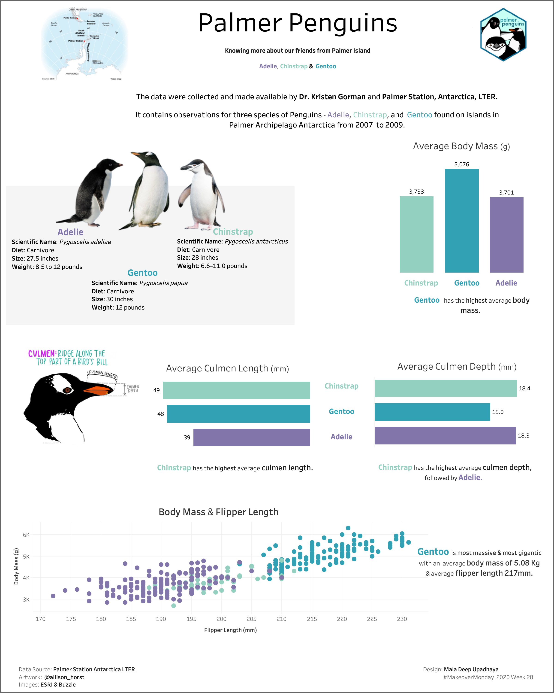

# Easy Way of Finding and Visualizing Missing Data in Python

### explore and visualize the incompleteness of a dataset in Python with missingno library.

This repo is beginners friendly tutorials in exploring and visualizing missing values,populary known as null (NAN)  values in any dataset using python.

## Missing Data Basics
As a data science disciple, I need to work more with data, conducting EDA, designing, and developing the model out of it. Data is nothing until you understand it and visualize it most effectively. During the process of exploring and expressing the data, we regularly come across having missing values in the dataset. Many missing values or null values are frequently seen in real-world's datasets. Missing data tends to introduce bias that leads to misleading results so they cannot be ignored. The reason behind missing values can be a variety of factors, including a lack of data, data loss throughout the procedure, and so on.

Missing Value treatment becomes important since the data insights or the performance of your work/model could be impacted if the missing values are not appropriately handled. Thus, we need to understand the way of finding the missing values and treating them before processing them further.

> Why focus on missing values: Missing data tends to introduce bias that leads to misleading results.

## Dataset: [Palmer Penguins](https://github.com/allisonhorst/palmerpenguins)

The data was collected and made available by [Dr. Kristen Gorman](https://www.uaf.edu/cfos/people/faculty/detail/kristen-gorman.php) and [Palmer Station, Antarctica, LTER](https://pal.lternet.edu). 

Dataset contain data for 344 penguins. There are 3 different species of penguins in this dataset, collected from 3 islands in the Palmer Archipelago, Antarctica.

## Data visualization based on the same dataset.

## After understanding and working with this notebook, you will be able to do:

* Explore the ways of checking missing values.
* Visualize the missing values with bar chart, matrix, heatmap and dendrogram.

## Explore Palmer penguins on yourself
> If you are interested to explore Palmer penguins on yourself, do check out my next project [here](https://github.com/maladeep/palmerpenguins-streamlit-eda)

